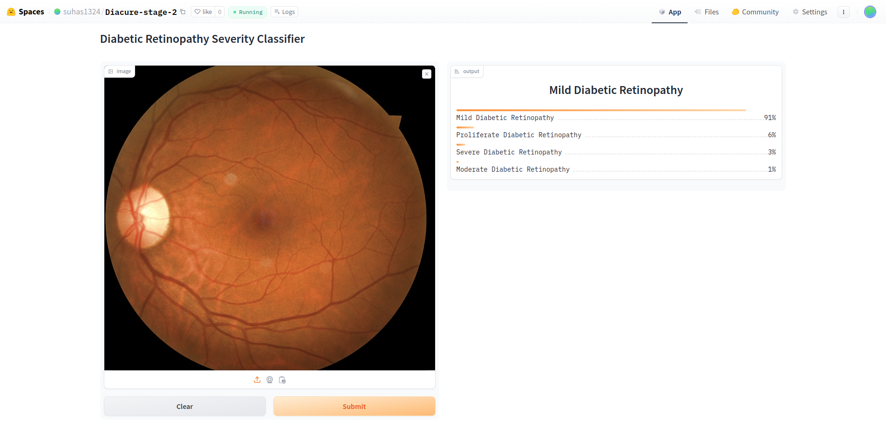

# DiaCure - Prediction of Diabetics through Retinal Images

## Overview
DiaCure is a machine learning project aimed at early detection of diabetes using retinal images. This approach leverages advanced algorithms and optimized neural networks to analyze retinal features for predicting diabetic status.

## Features
- **Retinal Image Analysis**: Utilizes a diverse dataset of retinal images.
- **Optimized Neural Networks**: Implements nature-inspired algorithms (e.g., Genetic Algorithms, Particle Swarm Optimization) for enhanced model performance.
- **User-Friendly Interface**: Designed for healthcare professionals with an emphasis on interpretability.

## Screenshots:



## Getting Started

### Prerequisites
- Python 3.x
- Jupyter Notebook
- Required libraries:
  ```bash
  pip install pandas numpy scikit-learn matplotlib Flask React
  ```

### Usage
1. **Clone the Repository**
   ```bash
   git clone https://github.com/yourusername/DiaCure.git
   cd DiaCure
   ```

2. **Data Preparation**
   - Gather a dataset of retinal images labeled with diabetic and non-diabetic statuses.

3. **Run the Jupyter Notebook**
   - Open Jupyter Notebook and load `diacure_model.ipynb`.
   - Follow the instructions within the notebook to preprocess images and train the model.

4. **Deploy the Interface**
   - Run the Flask backend to serve the model.
   - Use React for the frontend interface to interact with the model.

Feel free to modify any sections to better fit your needs!
